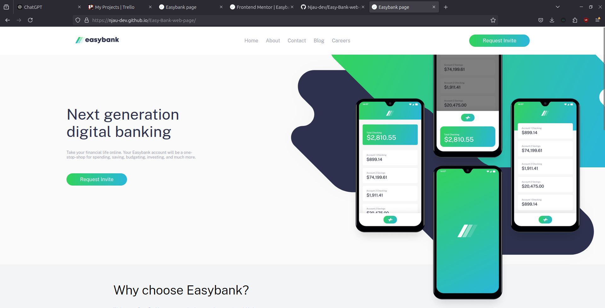

# Frontend Mentor - Easybank landing page solution

This is a solution to the [Easybank landing page challenge on Frontend Mentor](https://www.frontendmentor.io/challenges/easybank-landing-page-WaUhkoDN). Frontend Mentor challenges help you improve your coding skills by building realistic projects. 

## Table of contents

- [Overview](#overview)
  - [The challenge](#the-challenge)
  - [Screenshot](#screenshot)
  - [Links](#links)
- [My process](#my-process)
  - [Built with](#built-with)
  - [What I learned](#what-i-learned)
  - [Continued development](#continued-development)
- [Author](#author)


## Overview

### The challenge

Clone the Easybank webpage and add more pages, interractions and forms to make it dynamic and engaging

### Screenshot




### Links

- Solution URL: [Add solution URL here](https://www.frontendmentor.io/profile/Njau-dev)
- Live Site URL: [Add live site URL here](https://njau-dev.github.io/Easy-Bank-web-page/)

## My process

### Built with

- Semantic HTML5 markup
- CSS custom properties
- Flexbox
- CSS Grid
- Mobile-first workflow


### What I learned

- 
<h1>Some HTML code I'm proud of</h1>
```
```css
.why-list>div img {
    padding: 10px 0;
}
learned a new css selector
```
```js
const proudOfThisFunc = () => {
  console.log('🎉')
}
```

### Continued development

The first deployment is for the Frontend Mentor Challenge submission

I later added the pages and made it a multipage project with more animations and interractions to come

## Author

- Website - [EasyBank web page](https://njau-dev.github.io/Easy-Bank-web-page/)
- Frontend Mentor - [@Njau-dev](https://www.frontendmentor.io/profile/Njau-dev)
- Twitter - [@yourusername](https://www.twitter.com/yourusername)
